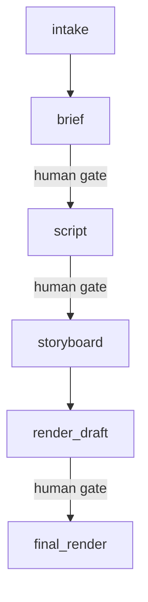

# Tracker-Agnostic Workflow Architecture

> Research/background copied from the Labs vault on 2026-06-06 as starting context for Work Machine. Preserve this as research; repo issues own implementation tasks.

This note captures the architecture pivot from the initial Hermes Kanban workflow-engine experiment toward a broader workflow system that can use friendlier team-accessible work surfaces, deterministic execution, first-class artifacts, and adapter-based storage/execution/tracking.

## Starting observation

The current `workflow-engine` experiment proved useful concepts:

- workflows can be declared concisely in `workflow.yaml`;
- deterministic code can validate workflow definitions, compile run plans, manage artifact paths, and represent gates;
- Hermes agents/skills can perform judgment-heavy steps;
- run manifests can preserve provenance and make workflow runs inspectable;
- human gates, agent review, and auto-pass policies can be modeled explicitly.

But it also exposed a product/architecture mismatch:

- Hermes Kanban is not a good long-term operator UI.
- Hermes Kanban is too low-level for artifact inspection and team collaboration.
- Hermes Kanban is not currently a general deterministic executor; it primarily spawns LLM workers.
- Putting deterministic workflow protocol into card prompts or skills makes the system brittle.

The new direction is to keep the deterministic workflow-engine core, but decouple it from Hermes Kanban as the primary surface.

## Core thesis

A serious version of this system should treat workflows as state machines, cards/issues as views, workers as adapters, and artifacts as first-class durable outputs.

```text
workflow.yaml
  -> workflow engine / run coordinator
  -> tracker adapter
  -> executor adapter
  -> artifact storage adapter
  -> notification adapter
```

The workflow engine owns the state machine. The visible work surface reflects the state machine. Execution and storage are delegated to adapters.

## Architecture layers

### 1. Workflow definition

`workflow.yaml` remains the concise, deterministic source for workflow structure:

- inputs;
- steps;
- dependencies;
- outputs;
- artifact contracts;
- gates;
- review decisions;
- validation requirements;
- executor requirements;
- optional subworkflow references.

Example concepts:

```yaml
steps:
  - id: storyboard
    title: Create storyboard
    consumes: [script]
    produces: [storyboard]
    executor:
      type: agent
      role: video_producer
    gate:
      reviewer: human
      decisions: [approve, request_changes, reject]

  - id: render_draft
    title: Render draft video
    consumes: [storyboard]
    produces: [draft_video]
    executor:
      type: script
      command: pnpm render -- --storyboard {storyboard.path} --out {draft_video.path}
    validate:
      - file_exists: draft_video
      - command: ffprobe {draft_video.path}
```

### 2. Run coordinator

The run coordinator is the deterministic state machine runtime. It should:

- create a run from a workflow definition and user input;
- snapshot the workflow version used for the run;
- compile steps into a concrete run plan;
- track current step state;
- choose the next runnable step;
- dispatch work to the right executor adapter;
- update the tracker adapter;
- verify declared artifacts;
- enforce gates;
- capture review decisions and feedback;
- route revisions or branches;
- preserve run history and provenance.

The coordinator should be able to run locally first, then later as a daemon or cloud service.

### 3. Tracker adapter

The tracker is the system-of-record surface for humans and teams. It should be adapter-based so different projects can use different work surfaces.

Potential tracker adapters:

- GitHub Issues;
- GitHub Projects;
- Trello;
- Linear;
- Hermes Kanban;
- local filesystem/dev mode.

The tracker adapter interface should support operations like:

```python
create_run_card(run)
update_run_status(run_id, status, step_id)
post_step_started(run_id, step)
post_step_completed(run_id, step, artifacts)
post_gate_required(run_id, gate, artifacts, instructions)
read_gate_decision(run_id, gate_id)
post_artifact_links(run_id, artifacts)
post_error(run_id, step, error)
```

The tracker does not need to understand the whole workflow engine. It needs to expose enough state, comments, labels, fields, and links for humans and teammates.

### 4. Executor adapter

The executor adapter does the work. This is the layer that fixes the Kanban limitation where only LLM workers are naturally spawned.

Potential executor adapters:

- `agent`: run a Hermes profile/skill or other LLM agent;
- `script`: run a deterministic command;
- `human`: create a manual task and wait;
- `webhook`: call an external service;
- `queue`: enqueue a heavy job for a capable worker;
- `subworkflow`: call another workflow;
- `noop`: tracking-only placeholder.

The workflow definition should declare execution requirements per step:

```yaml
executor:
  type: script
  command: pnpm render
  cwd: renderers/remotion-storyboard
  requires:
    - node
    - ffmpeg
    - remotion
```

This allows local or cloud workers to advertise capabilities and claim compatible steps.

### 5. Artifact storage adapter

Artifact storage must be a first-class layer, not an afterthought. Video workflows will produce substantial files that should not live inside GitHub.

The artifact layer should support:

- large file storage;
- stable URLs for review;
- private/public access controls;
- previews where possible;
- metadata/provenance;
- hashes and immutability checks;
- expiration/lifecycle policy;
- migration between storage backends;
- linking artifacts back into tracker cards/issues.

Potential artifact storage adapters:

- local filesystem for development;
- S3;
- Cloudflare R2;
- Frame.io for video review workflows;
- Google Drive;
- Dropbox;
- a self-hosted file server;
- future media-specific review surfaces.

Artifact declarations should be independent of the backend:

```yaml
artifacts:
  draft_video:
    path: videos/draft.mp4
    mime: video/mp4
    produced_by: render_draft
    storage:
      class: large_media
      visibility: private_review
```

A storage policy can map artifact classes to backends:

```yaml
storage:
  default:
    adapter: local_fs
    root: runs/{run_id}/artifacts

  large_media:
    adapter: r2
    bucket: labs-workflow-artifacts
    prefix: workflow-runs/{workflow}/{run_id}/
    signed_urls: true

  video_review:
    adapter: frameio
    project: Labs Video
```

The tracker card/issue should link to artifacts through the storage adapter, not assume artifacts are in GitHub.

For example, a GitHub issue might contain:

```markdown
## Artifacts

- [Storyboard](https://.../storyboard.md)
- [Draft video](https://signed-r2-url-or-frameio-link)

SHA256:
- draft_video: `...`
```

### Storage design considerations

Different artifacts have different needs:

- Markdown briefs/scripts/storyboards are small and can live locally, in a repo, or in object storage.
- Draft/final videos need large-object storage and preview links.
- Review artifacts may need private signed URLs.
- Final public artifacts may need durable CDN-backed URLs.
- Intermediate render caches may be large but disposable.
- Some artifacts should be immutable once approved.
- Some artifacts should expire after a run is complete.

This suggests using artifact classes rather than hardcoding one backend:

```yaml
artifact_classes:
  text_doc:
    adapter: local_fs
  large_media:
    adapter: r2
    signed_urls: true
  video_review:
    adapter: frameio
  render_cache:
    adapter: local_fs
    lifecycle: disposable
```

### Artifact index

Every run should have an artifact index, regardless of storage backend:

```yaml
artifacts:
  draft_video:
    status: ready
    logical_path: videos/draft.mp4
    storage_adapter: r2
    uri: r2://labs-workflow-artifacts/workflow-runs/labs-video/run-123/videos/draft.mp4
    review_url: https://signed-url.example
    mime: video/mp4
    size_bytes: 104857600
    sha256: abc123
    produced_by: render_draft
    created_at: 2026-06-06T00:00:00Z
```

The run coordinator should use this artifact index when posting tracker updates, validating gates, and notifying humans.

### Frame.io possibility

Frame.io is worth considering as a specialized artifact/review adapter for video workflows rather than only as storage. It may be best modeled as either:

1. an artifact storage adapter for video files;
2. a review adapter for timecoded comments and approvals;
3. both, depending on API capabilities and workflow needs.

If Frame.io is used, the workflow should still preserve engine-owned artifact metadata and tracker links. Frame.io should not become the only source of workflow truth unless deliberately chosen.

### S3/R2 possibility

S3 or R2 is likely the best generic large-artifact backend:

- cheap large object storage;
- signed review URLs;
- lifecycle policies;
- CDN/public delivery options;
- good fit for video renders, images, audio, and generated assets;
- independent from any particular tracker UI.

R2 may be attractive for cost and Cloudflare integration. S3 may be attractive for ecosystem maturity. The adapter boundary lets this choice change later.

### GitHub artifact boundary

GitHub can remain the tracker and discussion surface without storing large artifacts. GitHub Issues can link to artifacts, display manifests, record approvals, and connect to code/PRs, while storage lives elsewhere.

This separation is important:

```text
GitHub Issue = run state, discussion, review decision history
R2/S3/Frame.io = large media artifacts and previews
run.yaml/artifact index = provenance and machine-readable state
```

## Notification adapter

The notification layer should alert humans when attention is needed, especially at gates.

Potential notification adapters:

- Discord;
- email;
- Slack;
- Telegram;
- tracker-native notifications.

A human gate notification should include:

- workflow name;
- run title;
- current step;
- required decision;
- tracker link;
- artifact links;
- expected response syntax.

Example:

```text
Storyboard ready for review.
Run: Labs video - Agentic Work OS
Issue: <GitHub issue link>
Artifacts:
- storyboard.md
- script.md

Reply in the issue or here:
/approve
/request-changes <feedback>
/reject <reason>
```

If feedback arrives through Discord, the system should write it back to the tracker as a comment so the tracker remains the visible record.

## Human and agent gates

Gates should be explicit state-machine transitions, not ad hoc card prompts.

Gate modes:

- `human`: notify a human and wait for a decision;
- `agent`: ask a reviewer agent to apply criteria;
- `agent_then_human`: agent produces an advisory review, human decides;
- `auto_pass`: proceed only after deterministic validation and explicit policy.

Reusable learning from gates should not mutate skills automatically. A safer feedback loop is:

```text
human feedback
  -> classify feedback
  -> propose skill/rubric/workflow patch
  -> human approval
  -> update durable skill/config/docs
```

Agent reviewers can become more trusted over time by learning from approved patches and observed human decisions.

## Recommended first serious surface

The best initial serious tracker is probably GitHub Issues, optionally with GitHub Projects for board visualization.

Why GitHub Issues first:

- good API;
- durable comments;
- labels and states;
- Markdown and Mermaid support;
- easy links to artifacts, PRs, commits, and workflow docs;
- team-accessible;
- natural for code-adjacent workflows.

Trello remains a good future adapter for more visual or nontechnical collaboration. The engine should be designed so either surface can be swapped.

## Visualization

The engine should be able to render workflow definitions as diagrams before a run starts.

Useful outputs:

```bash
workflow-engine graph workflow.yaml --format mermaid
workflow-engine graph workflow.yaml --format svg
```

GitHub Issues can include Mermaid diagrams directly in the run issue body:



Visualization is useful both for workflow authors and reviewers who need to understand where a run currently is.

## Subworkflow reuse

Subworkflows should be supported eventually, but after the core run/tracker/executor/artifact model is stable.

Possible syntax:

```yaml
- id: make_thumbnail
  uses: workflows/thumbnail-v1.yaml
  with:
    source_video: final_video
  produces:
    thumbnail: thumbnail
```

The run coordinator would create a child run namespace:

```text
runs/<run_id>/subruns/make_thumbnail/
```

and map subworkflow outputs back to parent artifacts.

## Local and cloud workers

Execution should be able to happen on a local machine or cloud box. The coordinator should dispatch steps based on capabilities.

Examples:

```bash
workflow-engine worker run \
  --tracker github \
  --executor local \
  --capabilities script,agent,ffmpeg,remotion
```

```bash
workflow-engine worker run \
  --executor cloud \
  --capabilities browser,gpu-render,large-upload
```

For heavy local-only tasks, the coordinator can enqueue work that the local Mac mini claims when available. For cloud-capable tasks, the coordinator can send jobs to a remote worker or queue.

## Minimal vertical slice

A strong next milestone would be a single serious vertical slice:

1. Define a workflow with one agent step, one script step, one artifact-producing render step, and one human gate.
2. Create a run by chatting with an agent.
3. The engine creates a GitHub Issue as the run card.
4. The issue body includes workflow metadata, current step, artifact index, and a Mermaid graph.
5. A local worker executes a deterministic script step.
6. A Hermes agent executor handles a judgment-heavy step.
7. Rendered video is stored through a large-artifact adapter, likely local filesystem first and R2/S3 next.
8. The issue links to the video artifact instead of storing it in GitHub.
9. The human gate posts to the issue and notifies Discord.
10. Human feedback is written back as an issue comment.
11. The coordinator advances the state machine after approval.

This would prove the architecture without overbuilding distributed infrastructure immediately.

## Adapter map

```text
Workflow definition
  workflow.yaml

Coordinator/state machine
  run.yaml
  artifact-index.yaml
  event log

Tracker adapters
  GitHub Issues
  GitHub Projects
  Trello
  Linear
  Hermes Kanban
  local dev

Executor adapters
  Hermes agent/profile
  deterministic script
  human/manual
  webhook
  queue
  subworkflow

Artifact storage adapters
  local filesystem
  S3
  Cloudflare R2
  Frame.io
  Google Drive
  self-hosted file server

Notification adapters
  Discord
  email
  Slack
  tracker-native
```

## What this means for the existing workflow-engine project

Keep:

- workflow definitions;
- validation;
- deterministic planning;
- run manifests;
- artifact contracts;
- gate metadata;
- approval policies;
- drift refusal;
- dry-run inspection;
- the “fat engine, thin skill” principle.

Demote:

- Hermes Kanban as the primary UI;
- Hermes Kanban as the default system of record;
- LLM prompt cards as the way deterministic work gets done.

Add:

- tracker adapter interface;
- GitHub Issues tracker adapter;
- artifact storage adapter interface;
- local filesystem + R2/S3 artifact adapters;
- script executor;
- coordinator loop;
- Discord gate notifications;
- artifact index and review links;
- workflow graph output.

## Open design questions

- Should a workflow run be represented as one tracker card/issue, or should each step become a child card/issue?
- Should GitHub Issues be the first serious tracker, with GitHub Projects only as a view?
- What artifact storage backend should be first after local filesystem: R2, S3, or Frame.io?
- Should Frame.io be modeled as storage, review, or both?
- How much state should live in `run.yaml` versus tracker comments/fields?
- What is the simplest durable event log for coordinator decisions?
- How should Discord feedback be authenticated and mapped back to tracker comments?
- What is the minimum viable capability advertisement model for local/cloud workers?

## Working conclusion

The promising architecture is not “Hermes Kanban, but better.” It is a tracker-agnostic workflow coordinator with adapter-based tracking, execution, artifact storage, and notifications.

Hermes Kanban can remain a useful local/internal executor or compatibility adapter, but the serious system should be built around:

```text
state machine core
+ GitHub/Trello-style human surface
+ deterministic script/agent executors
+ large-artifact storage adapters
+ explicit human/agent gates
+ durable artifact index
```

For video workflows especially, artifact storage is not a detail. It is one of the central architecture layers. Large rendered outputs should live in S3/R2/Frame.io/local media storage as appropriate, while the tracker card or issue links to them and records review decisions.
